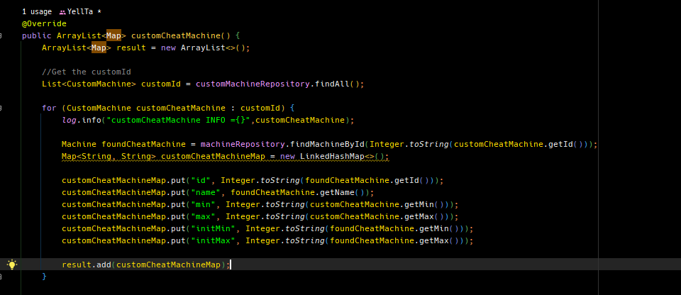

# Spring JPA  update가 아닌 insert

# Given

- Spring JPA를 이용해서 데이터를 Update한다.
- CustomMachine과 CustomFood 테이블에 update를 해야한다.
- 사용자는 CustomMachine과 CustomFood에 들어있는 데이터 중 일부를 Update해야한다.

# When

- jpa의 save 메소드를 이용해서 새로운 데이터를 insert하는 것이 아닌 기존의 data를 update 하려한다.

# Then - error

- 기존의 데이터를 선택해서 update하는 것이 아닌 새로운 데이터를 넣어버렸다.

<div style="display: inline-block; width: 100%; text-align: center">

<div style="display: inline-block; padding: 2em; margin: 0 auto; align-items: center
">
<h3 id="before" style="text-align: left">Before</h3>
<table style="text-align: left">
  <thead>
    <tr>
      <th>num(pk)</th>
      <th>id</th>
      <th>min</th>
      <th>max</th>
    </tr>
  </thead>
  <tbody>
    <tr>
      <td>1</td>
      <td>82</td>
      <td>145</td>
      <td>185</td>
    </tr>
    <tr>
      <td>2</td>
      <td>83</td>
      <td>145</td>
      <td>185</td>
    </tr>
  </tbody>
</table>
</div>


<div style="display: inline-block; padding: 2em; margin: 0 auto; align-items: center
">
<h3 id="after" style="text-align: left">After</h3>
<table style="text-align: left">
  <thead>
    <tr>
      <th>num(pk)</th>
      <th>id</th>
      <th>min</th>
      <th>max</th>
    </tr>
  </thead>
  <tbody>
    <tr>
      <td>1</td>
      <td>82</td>
      <td>145</td>
      <td>185</td>
    </tr>
    <tr>
      <td>2</td>
      <td>83</td>
      <td>145</td>
      <td>185</td>
    </tr>
    <tr style="color: #0a9384">
      <td>3</td>
      <td>82</td>
      <td>162</td>
      <td>180</td>
    </tr>
    <tr style="color: #0a9384">
      <td>4</td>
      <td>83</td>
      <td>170</td>
      <td>190</td>
    </tr>
  </tbody>
</table>
</div>

</div>


>⚙ 이떄 CustomMachine과 CustomFood 객체 구성은 Mysql DB의 custom_food, custom_machine의 구성과 같다.


---

# Given

## PrintDataV1.java[customCheatMachine()]

```java
customCheatMachineMap.put("initMin", Integer.toString(foundCheatMachine.getMin()));
customCheatMachineMap.put("initMax", Integer.toString(foundCheatMachine.getMax()));
```



add initMin , initMax data from machineRepository

## PrintDataV1.java[customCheatFood()]

```java
customCheatFoodMap.put("initMin", Integer.toString(foundCheatFood.getMin()));
customCheatFoodMap.put("initMap", Integer.toString(foundCheatFood.getMax()));
```


>💡 MachineRepository, FoodRepository has id ,name , min, max value from zenput

---

# When

### SaveData logic

### SaveData.java[Interface]


customCheatMachineDataSave()

customCheatFoodDataSave() 메소드를 인터페이스에 추가해준다.

### SaveDataV1.java[customCheatFoodDataSave()]


CustomFood 객체를 생성해서 post로 전달 받은 인자값을 저장한다.

저장한후 jpa의 save기능을 이용해서 저장한다.

### SaveDataV1.java[customCheatMachineDataSave()]


CustomMachine 객체를 생성해서 post로 전달 받은 인자값을 저장한다.

저장한후 jpa의 save기능을 이용해서 저장한다.

---

# Then - error

## SaveData 로직 오류

CustomFood, CustomMachine을 새롭게 생성한 후 저장하니 Update가 아닌 새로운 값을 insert해 버렸다.

---

# Solution

## way1

<aside>
💡

1. CustomMachine, CustomFood에서 findByidMy 라는 jpa 메소드를 이용해 CustomMachine, CustomFood 객체를 반환
2. 반환한 객체의 요소(id, min, max)값을 jpa의 .set 메소드로 update
</aside>


@Modifying 애노테이션은 int 타입밖에 반환을 할 수 없다. 

<aside>
✅ @Modifying 애노테이션을 이용해서 SQL 쿼리를 직접 날리는 경우 int 타입만 반환하기 떄문에 다른 객체 형식을 리턴할 수 없다.

</aside>

그렇기 때문에 @Modifying 애노테이션을 이용한 쿼리를 사용해 CustomFood, CustomMachine객체를 반환할 수 없게 되었다.

## 💰way2

<aside>

💡 1. @Modifying 애노테이션을 사용해서 직접 Update하는 쿼리문 작성하기

</aside>


따라서 해당 modifying 구문을 select 해서 customFood를 찾아주는 것이 아닌 아예 다이렉트로 update를 하는 구문으로 변경했다.

이때 @Param 애노테이션을 사용해서 매핑하도록 설정했다. 자바에서 인자와 이름이 같은 경우 사용하지 않아도 되지만 아직 그렇게 세팅되지 않은 곳이 많기때문에 꼭 써주는 것이 좋다.

만약 CustomFood 객체를 찾아서 업데이트 하는 경우는 

CustomFood.set(~~)를 이용해서 값을 업데이트 하면 된다.

<aside>
⚠️ 자동 번호를 num 
그리고 젠풋 아이디를 DB에서 테이블 이름을 id로 설정했다. 참고로 JPA는 primary key를 id로 보기 때문에 쿼리 메소드를 사용할 수가 없었다.

설계상 자동넘버가 부여되는 n**um은 id가 되어야 했고 젠풋에서 사용하는 id는 id가 아닌 다른 이름을 가졌어야 했다**

</aside>

---

# Reference

[스프링 데이터 JPA - 벌크 업데이트](https://jaime-note.tistory.com/53)
