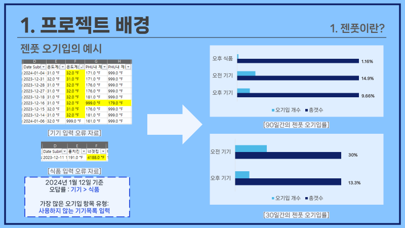

# BurgerputProject…

버거킹에서 STL(알바생인데 매니저 업무도 하는 알바생 ㅜㅜ)근무를 한지 7개월 쯤, 언제나 하는 매니저 업무 중 정말 귀찮은 작업이 하나 있는데 바로 어떤 홈페이지에 매장에서 사용하는 기기, 식품의 온도를 입력하는 것이다. 사실 온도를 재서 직접 입력해야 했지만 사실상 매장을 운영하면서 약 50가지가 되는 기기와 식품의 온도를 재가면서 매장을 운영할 수는 있지만!… 시간이 없기도하고 힘들다.

그래서 만들었다.

나 대신 온도를 대신 입력해줄 나만의 웹 봇 

온도 입력 프로그램 **Burgerput**.

# Burgerput이 가진 특징 세 가지

## 1. 매장에서 사용하는 기기, 식품의 목록을 커스텀화 한다.

가장 크고 핵심이 되는 기능중 하나이다. 

현재 온도를 입력해야하는 사이트를 A라고 칭하자

A사이트에는 입력해야하는 리스트가 약 7개가 되는데 이 중 2개의 목록(기기, 식품)을 자동으로 입력한다. 기기는 총 35개가 있고 매장에서 사용하는 기기는 총 21개 

식품은 3월13일 기준 22개가 있고 이 중 매장에서 사용하는 것은 20개이다. 기기와 달리 식품은 최대온도값이 지정되어 있지 않은 경우가 있다.

### 즉, 기기의 경우 사용하지 않는 기기를 입력할 수 있으며 식품의 경우 온도 범위를 잘못 입력할 수 있다.

내가 만든 자료의 일부이다… 오후 기기의 경우90일간 오기입률이 무려 10%다!! 30일간의 오기입률은 더욱 처참하다(30%).

모종의 이유(매장의 사정…)떄문에 오기입이 나면 아주 큰일이난다(실제로 이 프로그램을 사용하기 전 내가 오기입을 꽤나 자주해서 입이 열개라도 드릴 말씀이 없었다…). 별것 아닌것 같지만 매일 사진찍어서 보고해야하는 아주 중요한 작업이므로 오기입은 당연히 안된다.

매장에서 사용하는 기기만을선택한 사진이다. 실제 사이트에서는 사용하지 않는 기기는 999로 입력해야한다. 막상 사이트 들어가서 입력하면 잘 구분해서 넣은 것 같지만 

이렇게 처참하게 틀렸었다.

 Burgerput에서는 사용하는 기기만을 선택해 입력하고 사용하지 않는 기기는 자동으로 999가 입력되도록 설정했다.  

## 2. 온도의 범위를 좀 더 강력하게 규제한다.

해당 기능은 식품에 좀 더 강하게 적용한다. 식품의 경우 max값이 지정되어 있지 않는 경우가 종종 있었다. 

즉, 식품을 입력할 때 온도가 1000도가 넘어가는 끔찍한 오기입이 일어날 수도 있다는 이야기이다.(불타는 너겟이나 용암후라이 라던가…)

burgerputProject는 Max값을 지정해 위와 같은 에러가 나지 않도록 설정한다.

Burgerput 홈페이지의 식품의 예시이다. 185라고 최댓값이 지정되어 있지만 사실 실제사이트에서는 최댓값이 없다. 

## 3. 봇은 문제를 일으키지 않는다.

최종적으로 입력은 봇이 하도록 한다. 사용자는 burgerput을 거쳐서 범위에 맞는 온도, 입력해야하는 기기, 식품을 입력하고 burgerput은 입력받은 값을 가공하여 A사이트로 넘겨준다. 

즉 사람이 A사이트에 직접 온도를 입력하는 방식에서 burgerput이 필터링 기능을 한 번 해주고 전달 받은 값을 오차없이 A사이트에 입력하는 것이다.

### Burgerput을 제대로 사용하면 오기입할 확률이 0%라고 자신있게 말할 수 있다.

<aside>
💡 **결과**

## 약 한달 반 동안 기기만 총 19번 작성(오전 오후 모두 포함) 했지만 19번 중에 오기입이 난 경우는 없었다.

## 즉, Burgerput을 사용할 경우 입력을 까먹지 않는 이상 오기입할 확률이 0%라는 것이다.

</aside>

2024년 1월 24일 릴리즈되었고 3월까지 서비스를 운영하면서 치명적인 결함(로딩이 제대로 되지 않는 문제, 로딩에서 일어난 Error를 제대로 처리하지 못한 문제)을 제거해 서비스의 안전성을 확보했다.

 

시스템 파일의 로그이다.

3월 7일 이후부터는 거의 매일 사용되고 있다. (참고로 난 퇴사날짜가 3월 9일이라서 3월 이후에 사용한 적이 없다.)

# Burgerput의 핵심 로직(데이터 추출)

 

복잡한 로직은 따로 순서도를 만들었다. 

처음에 순서도를 짤 때에는

1. 홈페이지 진입
2. 홈페이지 리스트 목록 한 줄 한 줄씩 읽어오기(반복분)
    1. 이름추출
    2. 온도추출
    3. DB에 넣기

이런식으로 간략하게 flow frame? 같은 것을 만들고 계속 계속 살을 추가하면서 순서도를 만들었다.

1. 값을 저장할 Map생성
2. 홈페이지 field수만큼 반복
    1. 이름 추출
    2. 온도 추출
    3. DB에 넣기
    4. 추출한 정보(이름, 온도, id,) 1번 Map에 저장하기
3. 모든 field값이 저장된 Map출력하기

이런식으로 점점 살을 붙이고 최종적으로는 

이런 그림이 나오게 되었다. 

마찬가지로 순서도를 작성하면서 큰 프레임이 나오면 코드도 큰 프레임으로 맞춰서 작성하고 그 뒤에 세부적인 순서도가 추가되면 코드도 순서도에 맞게 짜나갔다.

순서도에서 예측했던 결과와 실제 코드를 짜면서 보여지는 결과를 종합하여 내가 원하는 값으로 동작하도록 짜려고했다.

그 결과, 꽤나 복잡한 로직이라고 생각했는데 하루 이틀만에 짜버렸다. 실제로 작성하는데 걸린시간은 2~3시간 안된 것 같다. 생각보다 잘 돼서 조금 놀랐던 기억도 난다. 

# BurgerputProject 개발을 수행하면서…

Front-end부분을 맡은 친구와 프로젝트를 진행하면서 많은 난항을 겪었다. 우선…

## 1. 개발 계획과정…

- 프로젝트 기획서
- 요구사항명세서
- 플로우차트
- API명세서
- Db구조
- 화면설계서
- 기능개발 계획서

여러가지 파일들이 만들어졌고 이게 개발을 하는 과정과 동시에 업데이트 되었나? 라고 질문한다면 그러지 않은 것 같다. 다행히 프로젝트의 크기가 크지 않았고 추가된 요구사항이 많지 않았기 때문에 큰 문제는 일어나지 않았지만 최종 보고서를 만들때 달라진 사항이 너무나도 많아 정리하느라 힘들었다. 

## 2. 시스템의 안전성 확보

24년도 1월 24일에 릴리즈했지만 치명적인 문제가 있었다.

### 1. 개발 시간 부족으로인한 테스트 수행 부족

나는 주 4~5일을 출근했고 front-end를 하는 친구는 주 3일이지만 학업과 병행하고있었다.  우리 둘 다 퇴사 날자를 어렴풋이 정해놨기 때문에 프로젝트를 만들고 배포하기 까지 약 8개월정도의 시간밖에 없었다. 

빠르게 서비스를 배포해야했기 때문에 테스트서버에 먼저 올려서 충분한 테스트 기간을 거치지 않았다. 때문에 서버에 올리고 바로 서비스를 진행했기 떄문에 첫 배포후에는 에러가 정말 많이 났었다.

서버 배포 후 발생한 가장 심각한 문제

1. 매일아침 사이트의 목록을 로딩하여 DB에 저장하는 로직에서 Error가 나면 DB가 초기화 되어 버렸다.
    
    해당 에러가 나는 경우는
    
    1. 사이트에 진입 불가
    2. 사이트의 구조 변경
    3. chrome Driver 실행에서 문제 발생
    
    대부분 위의 세 가지 경우였다.
    

가장 중요한 작업인 사이트의 목록을 로딩하여 DB에 저장하는 로직에서 Error가 나면 DB가 전부 초기화되어 버렸다(해당 에러는 완전히 수정 완료!). 

아무튼간에 이런 작업들은 실제로 A사이트가 열리는 시간에만 확인할 수 있었기 때문에(아침 8:30분) 하루에 딱 한 번만 확인할 수 있었다. 이 프로젝트 개발로 인해서 A사이트의 사용을 잠시 늦춰주거나 하는 방법을 선택할 수도 있었지만 개발보다는 매장에 피해가 가지 않는게 더욱 중요했기 때문에 우리가 확인할 시간은 아침 8:30분 밖에 없었다. 

또한 서비스배포도 24년도 1월에 무조건 배포해야 했기 때문에 어쩔수 없이 실제 서비스를 하면서 에러를 수정하는 방법을 선택했다.

## 3. 서버 셋업의 무조건적인 선행? 아니면 설계의 부재가 아닐까?…

개발을 처음 진행할 때 jar파일 즉 프로젝트 먼저 만들었다. 다 만들고 난 뒤서버를 먼저 만들고 서버 domain이나 필요한 작업들을 먼저 선행하고 그 다음 개발에 진입했어야 하지 않을까 하는 생각이 먼저 들었다.

실제로 아마존 AWS를 처음 다뤄보면서 부딪히는 것도 많았고 우리가 만든 애플리케이션의 spec이 정확히 얼마나 되는지 예측을 제대로 하지 않았기 때문에 서버에 올렸을때 큰 문제가 발생했다.(웹 컨트롤 라이브러리인 Selenium이 제대로 동작하지 않는 현상)

하지만 애플리케이션의 spec을 정확히 이해하고있고 selenium이 메모리를 얼마나 필요로하는지 예측했었다면 나중에 서버를 올릴때도 그렇게 크게 고생하지 않았을 것이다. 아마도 이번에 서버에 올리면서 고생했던 것의 해결책은 단순히 서버셋업을 먼저 진행하는 것이 아닌, 내가 만들 애플리케이션의 spec을 정확하게 예측하고 측정하지 못한 탓이 조금 더 가까울 것이다.