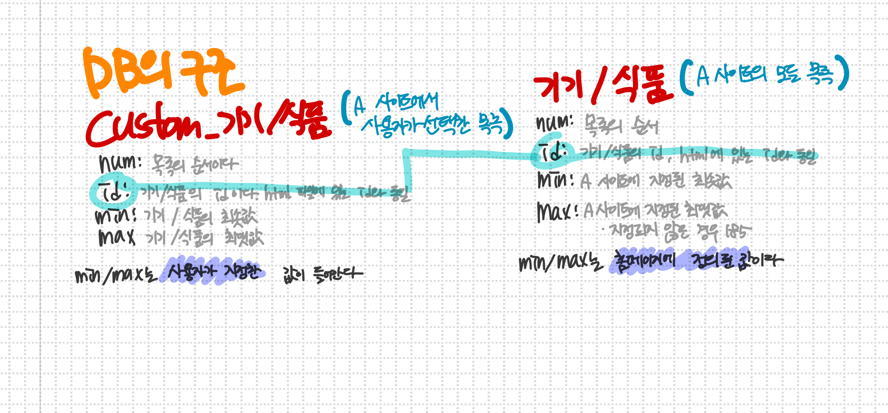
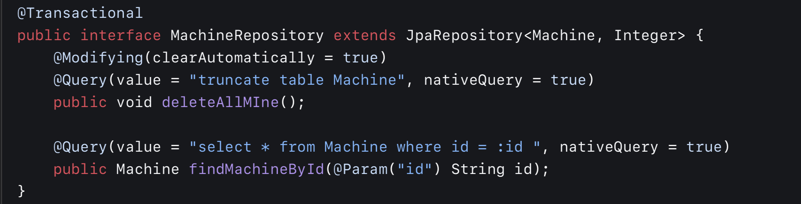
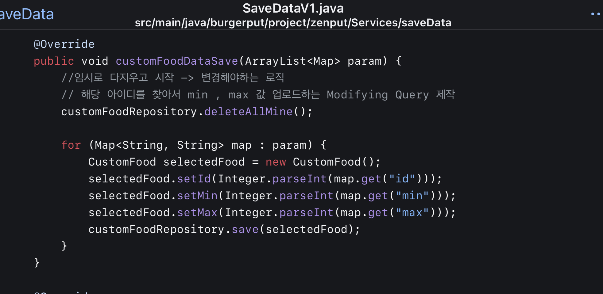

## 서버에 올리기 전

## 1. JPA와 @Query

이 문제는 영속성컨텍스트의 이해 부재가 대환장 에러를 만들어냈다.

### DB 테이블의 구조



두 테이블이 갖는 구조는 똑같으나, 다른 점은 Custom_기기/식품의 테이블에서는 사용자가 온도값을 세팅하는 것이다.

그리고 데이터를 저장하는 로직은 아래와 같다.


### 1. Custom Table과 달라진 값을 비교한다.

여기서 달라지는 값이란 총 세 가지 경우가 존재하는데

1. 데이터가 삭제되는 경우(기기나 식품이 목록에서 아예 사라지는 경우, 신제품이 나오면 사용하지 않는 식품이 삭제되기도 한다.)
2. 데이터가 추가되는 경우(Custom_기기/식품은 아무런 변화가 없다. 어짜피 나와도 바로 사용하지 않거나 나중에 사용하기 때문, 추가되어도 나중에 사용자가 Custom테이블에 선택하여 넣으면 된다.)
3. 온도 혹은 이름이 변경되는 경우(min, max의 범위가 달라지거나 이름이 변경되는 경우이다.

### 2. 달라진 값을 Custom 기기/식품에 적용한다.

어짜피 테이블은 변하지 않는 값인 id로 연결되어 있어서 변경되는 값은 크게 문제가 없었다.

추가되는 값도 사용자가 전체 기기/식품 목록에서 선택해야 Custom테이블에 들어가는 것이니까 괜찮았다.

문제는 지워지는 경우이다. 전체 목록에서 a라는 데이터가 지워지고 이것이 Custom테이블애 들어있었다면 문제가 된다. 따라서 전체 목록인 기기/식품에서 데이터가 지워지면 연결된 Custom테이블에서도 지워지게 설정했다.

### 3. 기기/식품의 Table값을 모두 지운다.

데이터 레이블의 순서를 지키고싶어서 나는 이런 방법을 택했다. 

num컬럼을 추가해 자동증가를 주고 몽땅 지웠다가 다시 저장하면 사이트와 동일한 데이터 컬럼 순서를 유지할 수 있었다. 

### 여기서부터 본격적인 에러 내용이 나온다.


1. deleteAll() 테이블의 모든 내용을 지우는 내가 만든 커스텀 쿼리이다.
2. .flush() 영속성컨텍스트에 내용을 전달한다.
3. initIncrement() 테이블의 자동증가를 초기화하는 커스텀 쿼리

현재는 1,3을 합쳐서 

<aside>
💡 truncate table machine

</aside>

을 사용했다.(truncate하면 자동증가도 초기화된다.)

문제는 DB 를 모두 지우는 쿼리를 사용하고 jpa메소드를 활용해 save를 했는데 


이런 에러를 마주했다.

## 나는 분명 테이블을 지웠는데!! 데이터가 존재한다니!!!

해당 문제는 내가 Spring JPA에 대한 이해가 필요했다.

### Custom_Query 사용



우선 스프링 jpa메소드를 사용하면 영속성 컨텍스트를 거치게 된다. 하지만 위와 같이 Query를 직접 작성하면 영속성 컨텍스트를 거치지 않는다. 

### 영속성 컨텍스트

스프링 jpa에서 사용한다. 프록시 db같은 것이다. 실제 DB에 적용하기 전에 영속성 컨텍스트를 만들어 놓고 거기에 jpa메소드를 사용하면 jpa가 쿼리를 만들어서 날려준다. 즉 자동으로 쿼리를 만들어서 날려주는 것, 하지만 바로 DB에 날리는 것이 아닌 영속성컨텍스트를 중간에 무조건 거친다.


machine데이터를 저장하는 메소드가 실행될때 transaction이 생성되고 영속성 컨텍스트가 만들어진다.

위 그림처럼 커스텀 쿼리는 진짜 데이터베이스에 바로 뿌려지고 jpa메소드인 .save()는 영속성컨텍스트에 들어가게 된다. 

커스텀쿼리는 데이터 베이스를 지우지만 영속성 콘텍스트는 적용이 되지 않기때문에 엔티티가 존재한다는 에러가 발생한 것이다.

## 내가 택한 해결안…


@Modifying(ClearAutomatically =true)옵션을 주었다.

영속성 컨텍스트를 비운다는 뜻 그러면 영속성컨택스트가 진짜 DB와 싱크가 맞춰지게돼 에러가 일어나지 않는다. 즉 저 옵션을 써주면 커스텀 쿼리를 다이렉트로 진짜 DB로 날리고 영속성 컨텍스트도 똑같이 영향을 받는다는 이야기다. 

다행히 영속성컨텍스트 관련 에러는 해결할 수 있었지만…

## 2. @Id 속성을 이해하지 못해 생긴 귀찮은 사용법…

Cheat 기능을 개발하면서 생긴 문제이다.

### Cheat?

우선 cheat기능에 대해 설명해보겠다.


Cheat는 온도를 하나하나 입력할 필요없이 버튼 하나만 누르면 지정해놓은 온도 범위 값으로 온도값을 설정해 값을 보낸다. 

Cheat 기능이 생기면서 DB 테이블에 변경되어야 하는 사항이 생겼다. 

## 변경전

| num | bigInt |
| --- | --- |
| id | int |

## 변경 후

| num | bigInt |
| --- | --- |
| id | int |
| min | int |
| max | int |

변경후에는 min과 max값이 생겼다. 

해당 Cheat기능이 생기면서 새로운 서비스가 필요했다. 바로 사용자가 범위를 저장하는 부분이다. 


이제는 최솟값과 최대값까지 추가해야하는 사항이 벌어졌다. 

여기까지는 그리 큰 문제가 되지 않았지만 중요한 점은 Custom_기기/식품 Table에 데이터를 추가하거나 삭제할 때 발생했다.

 



마찬가지로 customQuery인 deleteAllMine()을 이용해서  table을 truncate하고 데이터를 저장한다…(테이블에 있는 모든 데이터를 지우고 새로 저장)문제는 Custom기기/식품에 값을 넣을때마다 사용자가 custom기기/식품에 지정해놓은 온도 값이 초기화 된다는 것이다…

## Spring JPA를 이용해서 객체를 가져온뒤 CRUD를 진행하면 되는거 아니야??

그럴 수 있다먼 얼마나 좋을까, 그건 내가 개발할때에도 원하던 것이었다.

Spring JPA를 아용해서 객체를 가져올 수 없는 이유가 있었다. (말 그대로 있었다. 지금은 객체를 추출하는 방법을 알아냈다!)


우선 CustomMachine객체를 봐보자

객체의 구성은

num ,id, min, max이다. 

여기서 num은 PK값이다. 따라서 나는 @Id를 num에 줬었다. 

하지만 @Id를 num에 주면 문제가 생기는데 num은 자동증가값으로 만든 값이지 그렇게 의미있는 숫자는 아니었다. pk로 사이트에서 사용하는 id를 노출하는 것보다는 의미가 크게 없는 무작위 UUID나 숫자로 pk를 두는것이 보안상 좋기 때문이다. 

Spring JPA의 @Id가 num값이니 만약 Spring JPA의 findById를 사용하면 num을 기준으로 뽑아낼 것이다. 

하지만 기기/식품 선택에서 불러오는 값은 num 값이 아닌 

id, min, max만을 포함할 뿐이었다. 즉 num을 기준으로 객체를 가져올 수 없는것

그래서 나는 CustomTable에 데이터가 추가될 때 모든 데이터를 지우고 새로 입력하는 방안으로 바꿧다… 

삭제할 때에는 커스텀 쿼리를 날려서 삭제하도록 설정했다. (@Query 애노테이션)

## 발견한 이상적인 방법

나는 지금까지 @Id애노테이션이 PK로 지정된 컬럼에게만 적용이 된다고 생각했다. 

만약 Identifier를 num이 아닌 Id컬럼에 주게되어 객체를 꺼내서 쓸 수 있다면? 

그렇게 사용하는 방법이 Spring JPA를 제대로 쓰는 방법이라고 생각했다.


이번엔 내가 생각하던대로 id 컬럼에 @id애노테이션을 적용했다.


Custom_machine id =117 객체의  min은 -10 max는 0이다. 이걸 테스트해보자


# 테스트 성공!!!

결론은 @Id 는 말 그대로 Identifier 객체를 알아내는데 사용하는 것이며, PK와는 전혀 연관이 없다. 꼭 PK에게 주지 않아도 되는 값이다. 

# 결론

1. 해결 방안을 찾았으나 관련 DB가 연결되어 있는 작업이 워낙 많고 섣불리 고치다가 에러를 만들 확률이 크기 때문에 어떤 파일을 어떻게 고쳐야하는지 꼼꼼하게 사전조사 한 후에 수정하고 테스트한 후 배포할 생각이다.
2. @Id이슈를 고치면 JPA의 객체를 활용해서 DB에 CRUD를 진행하는 작업을 훨씬 더 수월하게 진행할 수 있다. 따라서 꼭 수정할 예정.

## 서버에 올린 후

### 1. 로딩이 제대로 수행되지 않았던 것

Burgerput 로딩은 실패하면 false를 return하고 성공하면 true를 리턴한다.


매일 아침 로딩이 수행되는 사진이다. 

```bash
34 8 * * * . /root/scripts/autoLoadingScript.sh
```

매일 아침 로딩을 수행하는 로직이 필요해 8:34분에 로딩을 수행하는 스크립트 파일을 만들어서 매일 아침 수행될 수 있도록 저장했다.

```bash
2024-03-15T08:37:53.768+09:00  INFO 36663 --- [nio-8080-exec-1] b.p.z.web.altPages.LoadingController     : return value =true

```

로딩이 성공하면 true, 실패하면 false를 주어서 로딩의 성공 여부를 확인했다. 하지만 로그에서 Loading이 false인데도 DB를 셋업하는 문제가 발생했다. (성공했을 시에만 DB setup)

### 에러 처리의 위치


try~catch() 구문을 통해서 에러를 잡기는 했지만 그저 에러로그를 표시했을 뿐이었다. 즉 에러가 나타나도 근본적인 처리를 하지 않고 그저 에러 로그만 표시했던 것이다. 

그래서 LoadingAndEnter.java에서 에러가 나도 LoadingController.java에서는 이미 처리가 된 에러이기 때문에 catch구문으로 에러를 잡을 필요가 없었다. 따라서 LoadingAndEnter.java에서 에러가나도 true가 리턴됐던 것이다.

### LoadingAndEnter.java 에서 에러를 처리하지 말자!

로직상 최상위 로직은 LoadingController.java이며 에러의 처리 여부는 LoadingContoller.java 에서 처리한다. 즉 LoadingAndEnter.java는 에러가 나타났을 시 처리의 여부를 LoadingController에게 보내주면 된다.


이번엔 에러처리를 정확히 어떤곳에서 해야하는지 파악하지 못해 생긴 에러이다. 이번 에러는 충분히 사전에 예방할 수 있었다. 

앞으로는 에러처리할 곳을 분명히 정리해서 이번과 같은 실수를 예방하자!